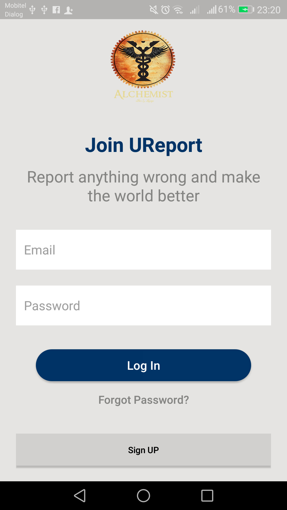

<html>
<head>
<h1>UReport 2019</h1>
</head>
<body>
  <h2>What is this repository for?</h2>
<ul>
  <li>This repository is for U Report android application which enables user to report a particular traffic violation to the public</li>
  <li>System Requiremnts: - Java 8, Android Studio</li>
  <li>Version 1.0</li>
</ul>  
<h2>How do I get set up?</h2>
<ul>
  <li>Clone or Download the repository</li>
  <li>open the project using android studio</li>
  <li>Build and Run the project</li>
</ul> 
  <h3>Default GUI of the application</h3>
  <table style="width:100%">
  <tr>
    <th>
    <th> 
    <th>
    <th>
    <th>
   </tr>
     <tr>
    <th> 
    <th>
    <th>
    <th>
    <th> 
   </tr>
    </table>
   
    <h3>Self Adaptivenes based on context identification [changes on main interface]</h3>
  <table style="width:100%">
    <tr>
    <th>
    <th> 
    <th>
    <th>
   </tr>
    <tr>
         <td align="center">context - still</td>
         <td align="center">context - walking</td>
         <td align="center">context - running</td>
         <td align="center">context - in a vehicle</td>
      </tr>
     <tr>
    <th>
    <th>
    <th>
    <th> 
   </tr>
     <tr>
         <td align="center">context - on a bicycle</td>
         <td align="center">context - tilting</td>
         <td align="center">context - unknown</td>
         <td align="center">context - battery level is critical</td>
      </tr>
     </table>
   
     <h3>Self Adaptivenes based on user history identification [age+gender]</h3>
   <table style="width:100%">
     <tr>
    <th>
    <th> 
    <th>
    <th> 
   </tr>
     <tr>
         <td align="center">Style Theme for Teenagers[Less than 19] Male</td>
         <td align="center">Style Theme for Teenagers[Less than 19] Female</td>
         <td align="center">Style Theme for Young Adult[20-30 years] Male</td>
         <td align="center">Style Theme for Young Adult[20-30 years] Female</td>
      </tr>
       <tr>
     <th>  
    <th>
    <th> 
    <th>
   </tr>
     <tr>
         <td align="center">Style Theme for Adults[30-40 years] Male</td>
         <td align="center">Style Theme for Adults[30-40 years] Female</td>
         <td align="center">Style Theme for Middle Aged[40-55 years] Male</td>
         <td align="center">Style Theme for Middle Aged[40-55 years] Female</td>
      </tr>
     <tr>
    <th> 
    <th>  
     </tr>
     <tr>
     <td align="center">Style Theme for Senior Citizens Male</td>
     <td align="center">Style Theme for Senior Citizens Female</td>
     </tr>
</table>
   <h3>Self Adaptivenes based on user behaviour identification [changes on main interfaces]</h3>
    <table style="width:100%">
     <tr>
    <th>
      </table>
<h2>Features</h2>
  <h4>Research Factors</h4>
  <ul>
<li>Dynamic Adaptability based on context awareness [user context + device context] </li>
    <ul>
      <li>Home --> Profile Tab --> Settings --> Account Settings --> Dynamic Behaviour --> Enable Dyanamic Behaviour based on User Context       </li>
      <li> Home --> Profile Tab --> Gesture: swipe down --> Enable Dyanamic Behaviour based on User Context </li>
    </ul>
<li>Dynamic Adaptability based on user behaviour </li>
      <ul>
      <li>Home --> Profile Tab --> Settings --> Account Settings --> Dynamic Behaviour --> Enable Dyanamic Behaviour based on User Behaviour       </li>
      <li> Home --> Profile Tab --> Gesture: swipe down --> Enable Dyanamic Behaviour based on User Behaviour </li>
    </ul>
<li>Dynamic Adaptability based on user history analyzation</li>
         <ul>
      <li>Home --> Profile Tab --> Settings --> Account Settings --> Dynamic Behaviour --> Enable Dyanamic Behaviour based on Age/Gender[User History]       </li>
      <li> Home --> Profile Tab --> Gesture: swipe down --> Enable Dyanamic Behaviour based on Age/Gender[User History]   </li>
    </ul>
</ul>
   <h4>Gustures</h4>
  <ul>
<li>R icon on Home Screen   Gesture: Pick up and move [draggable]  | Double Tap [to open the Create Post Interface]</li>
    <li> C icon on Create Post Screen  Gesture: Pick up and move [draggable]   | Double Tap [to open the camera and capture an image or a video and get it directly to the post]</li>
    <li> C icon on Create Post Screen  Gesture: Pick up and move [draggable]   | Double Tap [to open the camera and capture an image or a video and get it directly to the post]</li>
    <li> Notification Section  Gesture: swipe down [To refresh the Notifications]</li>
    <li>Profile Section  Gesture: swipe down [To see the current context awareness]</li>
</ul>
     <h4>Simulation</h4>
  <ul>
      <li>Home --> Profile Tab --> Settings --> Account Settings --> Dynamic Behaviour --> Enable Simulation      </li>
      <li> Home --> Profile Tab --> Gesture: swipe down --> Enable Simulation  </li>
</ul>
<h2>Tested Devices</h2>
<ul>
  <li>Huawei GR5 mini [os-Nougat]</li>
  <li>LG Nexus 5 [os-Marshmallow]</li>
  <li>Samsung Galaxy J7 [os-Marshmallow]</li>
  
play store link [Beta Version] - <a href="https://play.google.com/store/apps/details?id=alchemist.fit.uom.alchemists">view APK</a> 

</ul>
<h2>Contact Details</h2>
<ul>
  <li>Contributer: kasunchinthaka555@gmail.com</li>
</ul>
<h2>How to Contribute</h2>
<ul>
  <li>Please report issues at <a href="https://github.com/Kasun-Chinthaka-Piyarathna/ALCHEMISTS/issues">GitHub Issue Tracker</a>.</li>
  <li>Send your contributions as pull requests to <a href="https://github.com/Kasun-Chinthaka-Piyarathna/ALCHEMISTS/tree/master/">master branch</a>.</li>
</ul>
</body>
</html>
